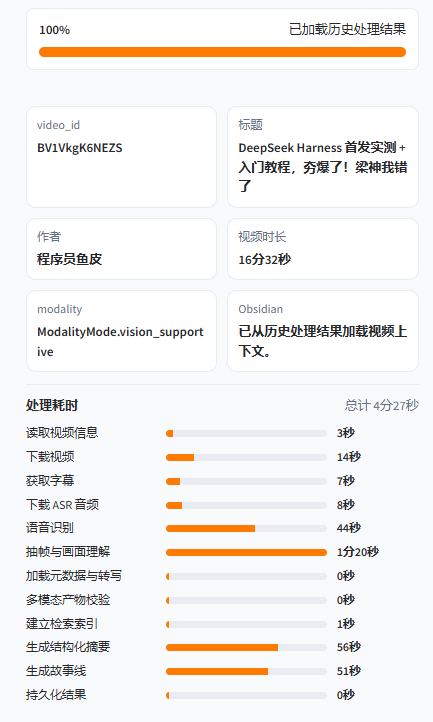
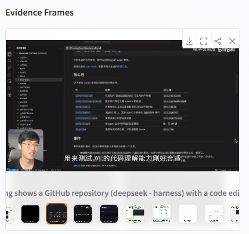
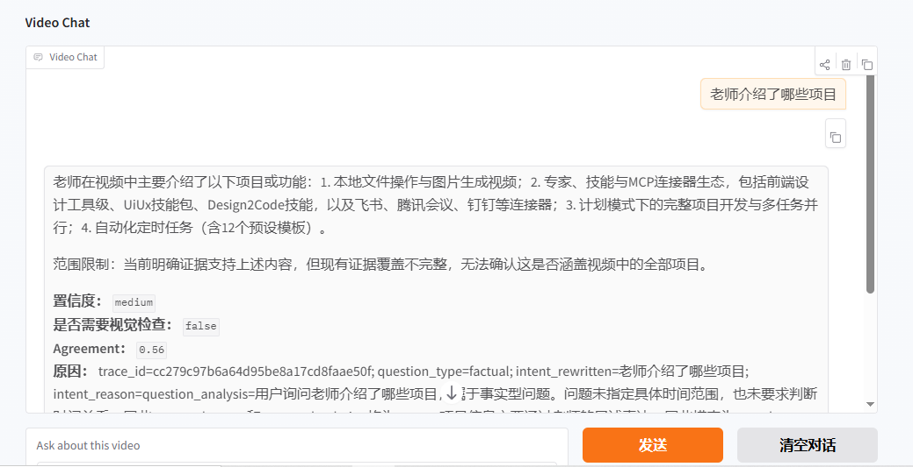
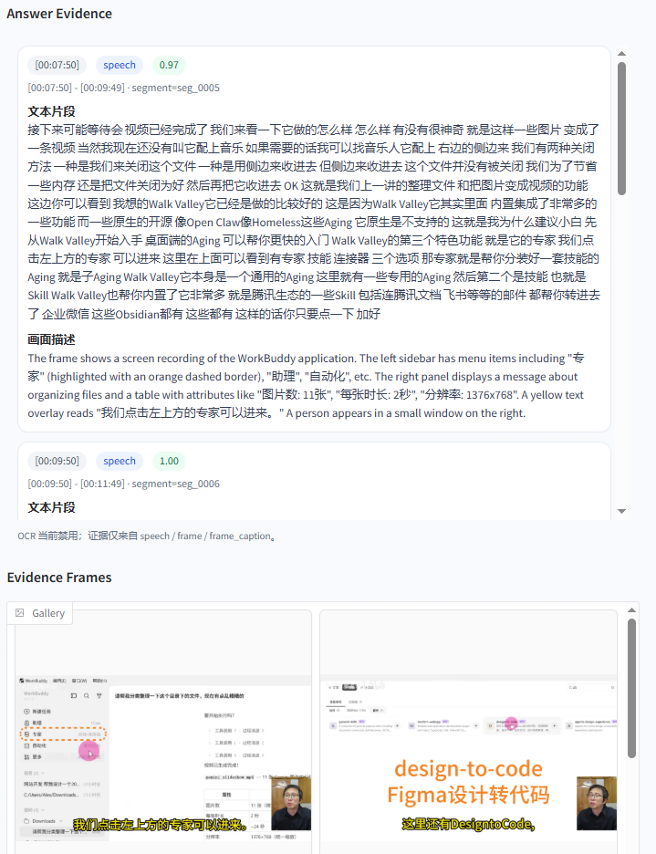

# Video Knowledge Agent

本项目是一个本地优先的多模态视频知识 Agent。它把长视频处理成带时间范围、证据类型和来源标识的知识单元，支持混合检索、查询驱动叙事和证据约束问答。

项目关注的是“回答是否被视频证据支持”，而不只是生成一段摘要。当前主要使用 **`speech`（字幕/ASR）**、**`frame`（关键帧）**、**`frame_caption`（视觉描述）** 三类证据，OCR 默认关闭。

## 项目亮点

- **多模态证据对齐**：将语音、关键帧和视觉描述对齐到统一的时间段，形成可追溯的 `multimodal_segments`。
- **混合检索**：结合 BM25 的词法匹配和 Chroma 的向量检索，兼顾专有名词、时间表达和语义相似度。
- **多样性证据选择**：使用 DPP 风格的选择策略减少重复片段，避免问答只返回相邻的 Top-K 结果。
- **证据缺口规划**：当已有证据不足以回答问题时，自动判断缺失的时间范围和模态，并触发定向关键帧补采样。
- **有据可依的回答契约**：回答携带证据 ID、时间戳、证据类型、置信度和视觉核验状态；无法支持的结论会被标记为不确定。
- **可恢复处理流水线**：按阶段记录状态，支持失败重试、限流、断点续跑和阶段级重启。
- **工程化接口**：同时提供 Typer CLI、Gradio Web UI 和 FastAPI 服务接口，并配套评测和回归测试。

## 证据处理流程

系统把视频理解拆成一条可检查的证据链：

```text
视频/URL
  → 下载与转写
  → 关键帧采样与视觉描述
  → 多模态时间段对齐
  → BM25 + 向量索引
  → 证据规划与多样性选择
  → 摘要 / Storyline / 问答
  → 时间戳与证据引用
```

问答阶段会先判断问题需要哪些证据，再检索和验证。证据不足时，系统会保留不确定性，而不是用模型常识补齐视频中没有出现的事实。

---

## 实际运行效果

下面的截图均来自本项目对真实视频的本地处理结果，覆盖不同主题与视频形态。展示重点不是单纯生成摘要，而是让处理过程、回答依据和视觉证据都可以被检查。

### 1. 流水线可观测性

每个阶段都会记录耗时与状态，既方便定位下载、ASR、抽帧、索引或摘要阶段的性能瓶颈，也能为失败重试和断点续跑提供依据。



### 2. 带时间范围的结构化 Storyline

长视频被整理为带起止时间、主题、要点、支持状态和证据数量的知识卡片。用户可以从结论回到对应视频区间，而不是只得到不可追溯的概括。


### 3. 代表帧与视觉语义

系统从视频中抽取代表帧并生成视觉描述，使代码演示、界面操作、图表和画面变化能够进入检索与问答证据链。



### 4. 证据约束问答

回答不仅返回自然语言结论，还会给出置信度、一致性分数、是否需要视觉复查以及回答范围限制，避免把模型常识伪装成视频事实。



### 5. 回答证据追踪

每条采用的证据都保留时间戳、片段 ID、证据类型、相关度、文本片段和画面描述，并同步展示对应关键帧，形成从“回答”到“原始画面”的完整追踪链路。



---

## 目录

- [核心能力](#核心能力)
- [实际运行效果](#实际运行效果)
- [架构概览](#架构概览)
- [环境要求](#环境要求)
- [安装](#安装)
- [快速开始](#快速开始)
- [配置](#配置)
- [典型流程](#典型流程)
- [可选集成](#可选集成)
- [产物与数据目录](#产物与数据目录)
- [限流、重试与断点续跑](#限流重试与断点续跑)
- [验证与诊断](#验证与诊断)
- [评测](#评测)
- [开发与测试](#开发与测试)
- [当前限制](#当前限制)
- [仓库结构](#仓库结构)

---

## 核心能力

| 模块 | 能力 |
|------|----------------|
| **视频接入** | 支持 yt-dlp URL 下载和本地音视频；优先使用字幕，无字幕时可使用 faster-whisper 本地转写。 |
| **多模态证据** | 对齐语音、代表帧和视觉描述；支持去重与模态路由，产物保存在 `data/videos/{video_id}/`。 |
| **内容理解** | 长视频分段归纳、概览、结构化大纲、查询驱动 Storyline，以及节点级证据支持检查。 |
| **检索** | Chroma 持久化索引、BM25 混合检索、DPP 风格证据选择和一致性信号。 |
| **交互接口** | Gradio 网页、Typer 命令行和 FastAPI 服务。 |

---

## 架构概览

```text
URL / file → ingest (yt-dlp + ffmpeg) → transcript & segments
    → keyframes + VLM captions → multimodal_segments.json
    → embed & index (Chroma) → summary + storyline
    → QA / chat (evidence-bound answers)
```

设计原则：**视频事实必须有对应证据支持**；证据不足时明确说明。长期记忆作为背景信息单独处理，不替代当前视频证据。

---

## 环境要求

- **Python** 3.11+（若系统默认 `python` 指向 3.10，请使用 `py -3.11`。）
- **ffmpeg** 在 `PATH` 中（真实 URL 下载与音视频处理依赖）。
- **yt-dlp**（已列入 `pyproject.toml` 依赖，随项目安装即可；命令行工具亦可单独维护）。
- **可选：** `faster-whisper`（无字幕时的本地 ASR）：`pip install -e ".[asr]"`。

项目若存在本地 ffmpeg  bundle，可将二进制置于例如：

```text
<project_root>/tools/ffmpeg/bin
```

并将该路径加入 `PATH`（与旧版说明一致，便于 Windows 下一键就绪）。

---

## 安装

```powershell
cd <project_root>
py -3.11 -m venv .venv
.\.venv\Scripts\Activate.ps1
py -3.11 -m pip install -U pip
py -3.11 -m pip install -e .
# 可选：本地 ASR
py -3.11 -m pip install -e ".[asr]"
# 可选：跑测试
py -3.11 -m pip install -e ".[dev]"
```

安装后可使用控制台入口（见 `pyproject.toml`）：

- `vka` → Typer CLI（`app.cli`）
- `vka-api` → HTTP API（`api.main`）

---

## 快速开始

### Web UI（Gradio）

```powershell
py -3.11 cli.py
```

常用参数：

```powershell
py -3.11 cli.py --port 7861
py -3.11 cli.py --share
py -3.11 cli.py --debug
```

默认地址：`http://127.0.0.1:7860`

已经处理完成的视频可以通过查询参数直接恢复为独立的历史结果页，便于复查、演示或保存截图：

```text
http://127.0.0.1:7860/?video_id=<video_id>
```

### HTTP API（FastAPI / Uvicorn）

```powershell
py -3.11 api.py --host 127.0.0.1 --port 8000
```

或使用：`vka-api --port 8000`

### CLI（Typer）

`python -m app.cli` 与 `python -m src.cli` 等价（`src.cli` 为薄封装）。

示例：

```powershell
py -3.11 -m app.cli process --url "<video_url>" --no-ocr --strict-llm
py -3.11 -m app.cli ask --video-id "<video_id>" --question "视频的核心论点是什么？"
py -3.11 -m app.cli rebuild-index --video-id "<video_id>"
py -3.11 -m app.cli refine-frames --video-id "<video_id>" --start 600 --end 720
py -3.11 -m app.cli show-config
```

`process` 支持本地文件：`--file path\to\video.mp4`；更多标志见 `py -3.11 -m app.cli process --help`。

---

## 配置

1. 复制环境变量模板：

   ```powershell
   copy .env.example .env
   ```

2. 在 `.env` 中填写 **LLM / VLM / Embedding** 的供应商 URL、模型名与密钥；**切勿**将 `.env` 提交到版本库。

3. 完整键名与默认值以 **`.env.example`** 为准（项目迭代时以仓库内文件为单一事实来源）。

**推荐起步配置示例（智谱 BigModel，可按需替换）：**

```env
LLM_PROVIDER=zhipu
LLM_API_KEY=${ZHIPU_API_KEY}
LLM_BASE_URL=https://open.bigmodel.cn/api/paas/v4
LLM_SUMMARY_MODEL=glm-4.6

VLM_PROVIDER=zhipu
VLM_API_KEY=${ZHIPU_API_KEY}
VLM_BASE_URL=https://open.bigmodel.cn/api/paas/v4
VLM_CAPTION_MODEL=GLM-4.6V-FlashX

EMBEDDING_BASE_URL=https://open.bigmodel.cn/api/paas/v4
EMBEDDING_MODEL=Embedding-3

DATA_DIR=./data
ASR_MODEL=small

ENABLE_OCR=false
EVIDENCE_TYPES=speech,frame,frame_caption
ALLOW_CODING_ENDPOINT_FOR_RUNTIME=false
REQUEST_TIMEOUT_SECONDS=600
```

**Runtime / Storyline 摘要相关（可按需调优）：**

```env
STRICT_LLM=false
SUMMARY_MAX_SEGMENTS=24
SUMMARY_SEGMENT_CHARS=500
SUMMARY_CAPTION_CHARS=300
STORYLINE_TOP_K=16
```

### LLM endpoint 安全提示

- **不要**将面向「代码 / Coding」场景的 OpenAPI 端点用于本项目的运行时推理（例如包含 `coding` 路径的 URL）。
- 若检测到 runtime LLM 指向 coding 端点，运行时会打印警告；设置 **`STRICT_LLM=true`**（或在 CLI 使用 `--strict-llm`）时可能直接失败退出，以避免误用。

---

## 典型流程

### 处理公开 URL

```powershell
py -3.11 -m app.cli process --url "<公开视频_URL>" --no-ocr --strict-llm
```

成功时 CLI 会汇总管线状态、摘要生成状态、Chroma 索引统计、阶段耗时以及摘要 / Storyline 片段预览。

### 单视频问答

进程重启后如需仅重建向量索引：

```powershell
py -3.11 -m app.cli rebuild-index --video-id "<video_id>"
py -3.11 -m app.cli ask --video-id "<video_id>" --question "……"
```

回答结构通常包含：`answer`、`evidence`、`timestamps`、`evidence_types`、`confidence`、`agreement_score`、`needs_visual_check`、`reason` 等（以当前模型与管线版本为准）。

---

## 可选集成

### Obsidian

配置 **`OBSIDIAN_VAULT_PATH`** 后，处理完成可尝试导出（具体路径规则见实现与 `COMPLETED_FEATURES.md`），例如：

- `10_Sources/Videos/{video_id} - {safe_title}/index.md`
- `10_Sources/Videos/{video_id} - {safe_title}/storyline.md`
- `10_Sources/Videos/{video_id} - {safe_title}/evidence.md`
- `10_Sources/Videos/{video_id} - {safe_title}/qa.md`
- `10_Sources/Videos/{video_id} - {safe_title}/updates.md`
- `40_MOCs/Video Index.md`

未配置 vault 时跳过导出，不阻塞主流程。

### MemPalace（MCP stdio）

默认关闭。启用后与 MemPalace MCP server 通信，用于**长期记忆补充**，不替代视频证据。

```env
MEMPALACE_PROVIDER=mcp_stdio
MEMPALACE_COMMAND=python
MEMPALACE_ARGS=-m mempalace.mcp_server
MEMPALACE_PALACE_PATH=
MEMPALACE_TIMEOUT_SECONDS=30
MEMPALACE_AUTO_STATUS=true
```

调试示例：

```powershell
py -3.11 scripts\smoke_test_mempalace_mcp.py
py -3.11 -m app.cli mempalace-status
py -3.11 -m app.cli mempalace-search "agent memory"
```

边界：**视频事实仍须由 `speech` / `frame` / `frame_caption` 支持**；MemPalace 结果以结构化 **`long_term_memory`** 等形式注入上下文，不会冒充视频内证据。

---

## 产物与数据目录

处理产物默认位于：

```text
data/videos/{video_id}/
```

常见核心文件包括：

- `metadata.json`
- `transcript.json`
- `multimodal_segments.json`
- `summary.json`
- `storyline.json`
- `llm_logs/`

向量库默认持久化目录可参考 `.env` 中的 **`CHROMA_PATH`**（示例中为 `./data/chroma`）。

---

## 限流、重试与断点续跑

对外部依赖的请求（LLM、VLM、Embedding、yt-dlp、云 ASR 等）由调度参数限制并发与最小间隔，可在 `.env` 中调节，例如：

```env
LLM_MAX_CONCURRENCY=2
LLM_MIN_INTERVAL_SECONDS=1.5
VLM_CAPTION_CONCURRENCY=3
VLM_MIN_INTERVAL_SECONDS=2.0
EMBEDDING_MAX_CONCURRENCY=1
EMBEDDING_MIN_INTERVAL_SECONDS=1.0
YTDLP_MAX_CONCURRENCY=1
YTDLP_MIN_INTERVAL_SECONDS=6.0
ASR_MAX_CONCURRENCY=1
ASR_MIN_INTERVAL_SECONDS=2.0
API_MAX_RETRIES=3
API_RETRY_BASE_DELAY_SECONDS=2.0
PIPELINE_RESUME=true
PIPELINE_FORCE_STAGE=
```

每个视频目录会维护 **`processing_state.json`**。再次运行 `process` 时，默认跳过已成功且产物存在的阶段；需要全量重跑可使用 `--force-refresh`，或：

```powershell
py -3.11 -m app.cli process --url "<video_url>" --force-refresh
py -3.11 -m app.cli process --url "<video_url>" --force-stage summary
py -3.11 -m app.cli process --url "<video_url>" --no-resume
```

---

## 验证与诊断

| 目的 | 命令 |
|------|------|
| 检查当前解析到的运行时配置 | `py -3.11 scripts\check_runtime_config.py` |
| 文本摘要模型冒烟 | `py -3.11 scripts\smoke_test_llm.py` |
| 视觉 caption 模型冒烟 | `py -3.11 scripts\smoke_test_vlm.py` |

上述脚本会输出 provider、base URL、model、HTTP 状态与响应正文片段，**不会打印 API key**。

---

## 评测

项目提供可执行评测入口，用于检查检索命中、引用有效性和证据不足时的拒答行为。回归测试通过不代表公开视频基准上的准确率，模型效果需要在标注数据集上单独测量。

评测覆盖检索命中率、MRR、片段精确率/召回率、时间范围 IoU、引用有效性和拒答准确率，详见 [评测设计](docs/evaluation.md)。

证据选择器中的 DPP 是项目命名：当前实现使用相关性、余弦相似度惩罚和模态奖励进行贪心选择，不是严格的行列式概率采样，也不承担事实真伪验证。

```powershell
py -3.11 -m app.cli eval --dataset data\eval\cases.jsonl --top-k 5 --output data\eval\report.json
py -3.11 -m app.cli eval --dataset data\eval\cases.jsonl --run-answers --fail-on-threshold
```

评测 schema、指标、推荐开源基准（VideoRAG/LongerVideos、EgoSchema、ActivityNet-QA、NExT-QA、TVSum/SumMe）和改进路线见 **`docs/evaluation.md`**。

---

## 开发与测试

```powershell
py -3.11 -m pytest
```

测试配置见 `pyproject.toml` 中 `[tool.pytest.ini_options]`；功能清单见 **`COMPLETED_FEATURES.md`**。

---

## 当前限制

- **平台与站点策略**：下载成功率依赖 yt-dlp 与各站点策略变更。
- **ffmpeg**：真实 URL 与转码路径依赖本机 ffmpeg 可用。
- **视觉理解**：当前阶段以关键帧 + caption 为主，非完整像素级视频理解。
- **OCR**：按策略关闭；启用需依赖可选组件并自行评估成本与效果。
- **ASR 质量**：本地模型与音源质量直接影响转写效果。
- **向量库**：持久化路径需自行备份；重建索引仍可从 JSON 等产物恢复索引内容（参见 `rebuild-index`）。

---

## 仓库结构

| 路径 | 职责 |
|------|------|
| `app/` | 主包：配置、管线、检索、推理、UI、API、vision、storage 等 |
| `src/` | `python -m src.cli` 入口封装，转发至 `app.cli` |
| `cli.py` | 启动 Gradio Web UI |
| `api.py` | 启动 FastAPI 应用 |
| `scripts/` | 配置检查与冒烟脚本 |
| `tests/` | Pytest 用例 |

---

## 版本

当前包版本见 `pyproject.toml` 中 `version`（例如 `0.1.0`）。
